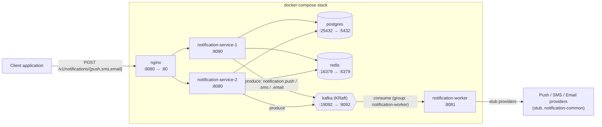

# Notification System

A multi-channel (push / SMS / email) notification system built as a set of
Spring Boot services, designed and implemented in phases from a single
synchronous server up to a queue-decoupled, horizontally-scaled system. See
[`design.md`](design.md) for the full design write-up and
[`spec/README.md`](spec/README.md) for the phased spec/plan index.

## 🌟 Highlights

- Multi-channel notifications (push, SMS, email) behind a single REST API,
  each channel dispatched through its own provider interface.
- Decoupled, horizontally-scalable architecture: the API layer publishes
  events to Kafka, and a separate worker service consumes and delivers them.
- `notification-service` runs as two load-balanced instances behind an
  Nginx reverse proxy, with Postgres for persistence and Redis for caching
  user/device lookups.
- Shared domain, event, and provider-contract types live in
  `notification-common` (a Spring Boot auto-configured library module) so
  the service and worker never duplicate wire formats.
- One `docker-compose.yml` brings up the entire stack — Postgres, Redis,
  Kafka, both service replicas, the worker, and Nginx.

## ℹ️ Overview

This repo is a Maven multi-module project with three modules:

| Module | Role |
|---|---|
| [`notification-common`](notification-common) | Shared `NotificationEvent`, `NotificationChannel`/`NotificationTopics`, and provider contracts (`PushProvider`, `SmsProvider`, `EmailProvider`) plus stub provider implementations, exposed to the other modules via Spring Boot auto-configuration. |
| [`notification-service`](notification-service) | Public REST API (`/v1/notifications/{push,sms,email}`). Validates requests, resolves user/device data (Postgres + Redis cache), and publishes a `NotificationEvent` to the matching Kafka topic. |
| [`notification-worker`](notification-worker) | Kafka consumer group (`notification-worker`) that reads `notification.push` / `notification.sms` / `notification.email` and hands events to the stub providers for delivery. |

### Component diagram



`notification-common` isn't a runtime component — it's a compiled dependency
of both `notification-service` and `notification-worker`, which is why the
Kafka event shape and topic names in the diagram above stay in sync between
producer and consumer.

## 🚀 Usage

Once the stack is running (see Installation below), send a request through
Nginx to any of the three channel endpoints:

```bash
curl -X POST http://localhost:8080/v1/notifications/push \
  -H "Content-Type: application/json" \
  -d '{
        "to": [{"user_id": 1}],
        "content": [{"type": "text", "value": "Hello!"}]
      }'
```

The service responds `202 Accepted` once the event has been persisted and
queued; delivery happens asynchronously via `notification-worker`.

Each service also exposes Spring Boot Actuator health checks (used by the
Docker healthchecks below):

- `notification-service`: `http://localhost:<port>/actuator/health`
- `notification-worker`: `http://localhost:8081/actuator/health`

## ⬇️ Installation

The fastest way to run the whole system is Docker Compose — it builds both
Spring Boot apps and starts every dependency (Postgres, Redis, Kafka, Nginx)
for you.

**Prerequisites:** Docker and Docker Compose.

```bash
# from the repo root
docker compose up --build
```

This starts:

| Service | Host port | Notes |
|---|---|---|
| `nginx` | `8080` | Entry point — load-balances across the two `notification-service` replicas |
| `notification-service-1` / `-2` | *(internal only)* | Reached through `nginx`, not published to the host |
| `notification-worker` | `8081` | Kafka consumer, exposes Actuator health |
| `postgres` | `25432` | `notifications` / `notifications` / `notifications` (db/user/password) |
| `redis` | `16379` | No auth |
| `kafka` | `19092` | Single-node KRaft broker, host-side debugging listener |

Wait for all containers to report healthy (`docker compose ps`), then send
requests to `http://localhost:8080` as shown above.

To stop everything:

```bash
docker compose down
```

For building/testing the modules directly with Maven, or making code
changes, see [DEVELOPMENT.md](DEVELOPMENT.md).

## 💭 Feedback and Contributing

Known follow-up work is tracked in [`spec/tech-debt.md`](spec/tech-debt.md).
For local development setup, build/test commands, and code style rules, see
[DEVELOPMENT.md](DEVELOPMENT.md) and the repo-wide [`CLAUDE.md`](../CLAUDE.md).
