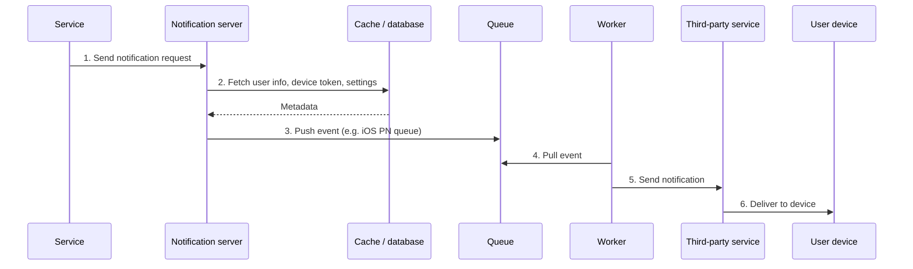

# Requirements
- Notification type: push notification, sms message, email
- Soft real-time: user will receive notification asap but in high load, slight delay is acceptable
- Supported devices: iOS, Android, laptop/desktop
- Triggers notification: by client application, scheduled on server-side
- Opt-out: able to opt out to stop receive notifications 
- Workload: 10M mobile push notification, 1M SMS, 5M emails

# High-level design

## Different types of notification
### iOS push notification
Provider → Firebase Cloud Messaging (FCM) → Android

- Provider: build and send notification request to Apple Push Notification Service(APNS)
  - Device token: unique device identifier
  - Payload: JSON format payload
  - APNS
  - iOS device
### Android push notification
Provider → Firebase Cloud Messaging (FCM) → Android
### SMS message
Provider -> SMS service -> SMS

### Email
Provider -> Email Service -> Email

## Contact info gathering
On sign up -> require: mobile device tokens, phone numbers, email -> store data in DB
- Address & phone number: user table
- Device token: device table
one user could have multiple devices (1-n relation)

## System Design simple
### Design
- Client Service: any service that triggers notification sending events (many)
- Notification System: Provide APIs for client services and build notification payloads for third party services
  - Single server 
  - Need to support multiple 3rd servers with easy to extend
- 3rd party services: Delivering notification to users

### Cons
- Single point of failure
- Hard to scale
- Performance bottleneck: heavy task could affect overall system

## System design enhanced
### Improvement
- Move database and cache out of notification server
- Add more notification servers and setup auto horizontal scaling
- Include message queue to decouple system components

### Design
- Client Service: any service that triggers notification sending events (many)
- Notification System: Provide APIs for client services and build notification payloads for third party services
    - Basic validation to verify emails, phone numbers
    - Query database or cache to fetch data to render notification
    - Push notification data to message queues
    - Need to support multiple 3rd servers with easy to extend
- 3rd party services: Delivering notification to users
- Cache: user info, device info, notification template
- DB: store data of user, notification, settings
- Message queue: each notification type ha a distinct message queue
- Workers: servers that pull notification events from message queues and send to 3rd services

### Flow



### Sample API
POST https://api.example.com/v1/sms/send
body:

```json
{
  "to": [
    {
      "user_id": 123
    }
  ],
  "from": {
    "email": ""
  },
  "subject": "",
  "content": [
    {
      "type": "",
      "value": ""
    }
  ]
}
```

# System design deep dive
