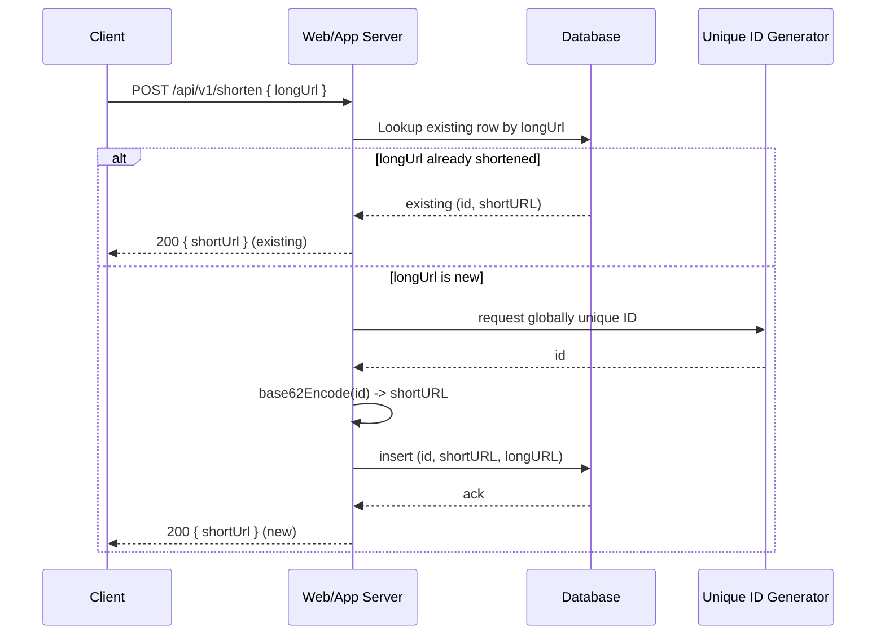
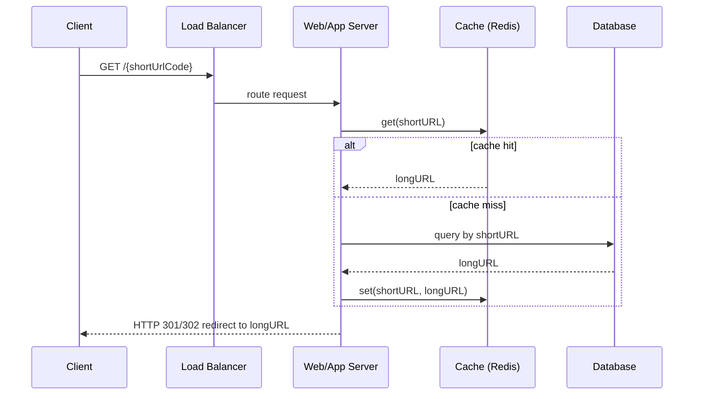
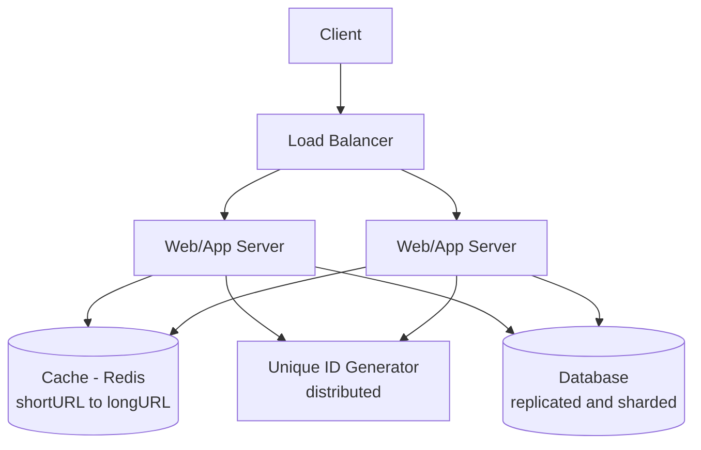

# URL Shortener — System Design

## 1. Requirements & Scope

### Functional Requirements
- Create a shortened URL from a given long URL.
- Redirect a shortened URL to its original long URL.
- Shortened URLs must be as compact as possible.
- Allowed characters in the short code: `0-9`, `a-z`, `A-Z` (62 alphanumeric characters).
- No update or delete capability for shortened URLs (out of scope for v1).

### Non-Functional Requirements
- High availability and fault tolerance.
- Scalable to a very large number of URLs and requests.
- Redirection must be fast (low latency).

## 2. Back-of-the-Envelope Estimation

| Metric | Value |
|---|---|
| Write (new short URLs) | 100 million/day ≈ 1,160 requests/sec |
| Read:Write ratio | 10:1 |
| Read (redirects) | ≈ 11,600 requests/sec |
| Storage horizon | 10 years |
| Total records (10 yrs) | 365 billion |
| Avg record size | 100 bytes |
| Total storage | 365B × 100B ≈ 36.5 TB |
| Character set size | 62 (`0-9`, `a-z`, `A-Z`) |
| Short code length | 7 characters → 62^7 ≈ 3.5 trillion combinations (enough headroom) |

## 3. API Design

### 3.1 Create short URL
```
POST /api/v1/shorten
Body: { "longUrl": "<original long URL>" }
Response: { "shortUrl": "<shortened URL>" }
```

### 3.2 Redirect
```
GET /<shortUrlCode>
Response: HTTP redirect (301 or 302) to the original long URL
```

## 4. Data Model

Simple relational table:

| Column | Type | Notes |
|---|---|---|
| `id` | PK, bigint | globally unique ID, source for base62 short code |
| `shortURL` | varchar | generated short code |
| `longURL` | text | original URL |
| `createdAt` | timestamp | row creation time |
| `expiresAt` | timestamp | `createdAt` + 1 year (default TTL, see §10); background job purges expired rows |

(Optional, for later: `userId`, click-count/analytics fields. No custom/vanity short codes — out of scope.)

## 5. Short Code Generation — Approaches

### Approach A: Hash + Collision Resolution
- Hash the long URL (CRC32, MD5, SHA-1), take the first 7 characters.
- On collision, append a fixed salt string and rehash; check DB (bloom filter can speed up collision checks) until unique.
- ✅ Fixed-length short URL.
- ❌ Needs collision detection (extra DB round-trips); more moving parts.

### Approach B: Base62 Conversion (recommended)
- Generate a globally unique ID via a **DB-based ticket server** (a dedicated table/DB with an auto-increment column used only to hand out unique IDs — see §10 decision).
- Convert the ID to base62 using the alphabet mapping: `0–9 → 0-9`, `10–35 → a-z`, `36–61 → A-Z`.
- Example: ID `2009215674938` → `"zn9edcu"`.
- ✅ No collisions possible; simpler logic; predictable length growth.
- ❌ Variable length as IDs grow; sequential IDs are guessable (security concern — mitigate by randomizing ID allocation or adding a random offset/shuffle before encoding).

**Decision for implementation:** Base62 conversion is simpler to implement correctly and avoids collision-retry complexity — prefer this for the initial build. Revisit hash-based approach only if unique-ID-generator infrastructure becomes the bottleneck.

## 6. Core Flows

### 6.1 Shorten URL (write path)



1. Client submits `longUrl`.
2. Check DB/cache: does this `longUrl` already have a short code? If yes, return the existing `shortUrl` (idempotency — avoids duplicate entries for the same long URL).
3. If new: generate a globally unique ID.
4. Convert ID → base62 short code.
5. Persist `(id, shortURL, longURL)`.
6. Return `shortUrl` to client.

### 6.2 Redirect (read path)



1. Client requests `GET /<shortUrlCode>`.
2. Load balancer routes to a stateless web server.
3. Check cache (e.g. Redis) for `shortURL → longURL`.
4. Cache hit → return long URL immediately.
5. Cache miss → query DB, populate cache, return long URL.
6. Respond with HTTP redirect to `longURL`.

**301 vs 302:**
- **301 (permanent):** browser caches the redirect; subsequent requests for the same short URL skip the service entirely. Lower server load, but no analytics on repeat visits.
- **302 (temporary):** every request hits the service first. Higher load, but enables click analytics (timestamp, referrer, geo, etc.).
- Default choice: **302**, since click analytics is a common product requirement; switch to 301 only if analytics is explicitly not needed.

## 7. High-Level Architecture



Components:
- **Load balancer** — distributes incoming read/write traffic.
- **Stateless web servers** — handle shorten + redirect requests; scale horizontally by just adding instances.
- **Cache layer** — read-heavy workload (10:1), so caching `shortURL → longURL` is critical to keep redirect latency low and DB load down.
- **Database** — persistent storage; needs replication (availability/durability) and sharding (handles 36.5 TB / 365B rows over 10 years).
- **Unique ID generator** — a **DB-based ticket server**: a dedicated table/DB whose sole job is handing out unique, monotonically increasing IDs (via auto-increment), consumed by app servers before base62 encoding.

## 8. Scalability & Operational Considerations

- **Rate limiting:** throttle shorten requests **per IP** to prevent abuse.
- **Database scaling:** replication for read scaling + fault tolerance; sharding for horizontal write/storage scaling (shard key candidate: `id`).
- **Web server scaling:** stateless design → trivial horizontal add/remove behind the load balancer.
- **Analytics:** track click count, timestamp, referrer/source per short URL (only feasible cleanly with 302 redirects).
- **Reliability:** design for availability, consistency, and fault tolerance per standard distributed-system principles.
- **Cache:** Redis, **LRU** eviction policy.
- **Expiration:** short URLs expire **1 year** after creation (default TTL); a background job purges expired rows.

## 9. Approach Comparison

| Aspect | Hash + Collision Resolution | Base62 Conversion |
|---|---|---|
| Short URL length | Fixed | Variable (grows with ID) |
| Requires unique ID generator | No | Yes |
| Collision handling | Requires detection/retry | Not possible (IDs are unique) |
| Predictability | Unpredictable | Predictable (guessable — security consideration) |

## 10. Decisions for Implementation Phase

| Question | Decision                                                                    |
|---|-----------------------------------------------------------------------------|
| Unique ID generator | **DB-based ticket server** (dedicated auto-increment table/DB)              |
| Custom/vanity short codes | **No** — not in scope                                                       |
| Expiration policy | **1 year** TTL from `createdAt` for now; background job purges expired rows |
| Cache technology / eviction | **Redis**, **LRU** eviction                                                 |
| Rate-limit strategy | **Per-IP** throttling on the shorten endpoint                               |
| Sharding key / strategy | **Consistent hashing** on `shortURL` (with virtual nodes) that support 10-year growth horizon     |
